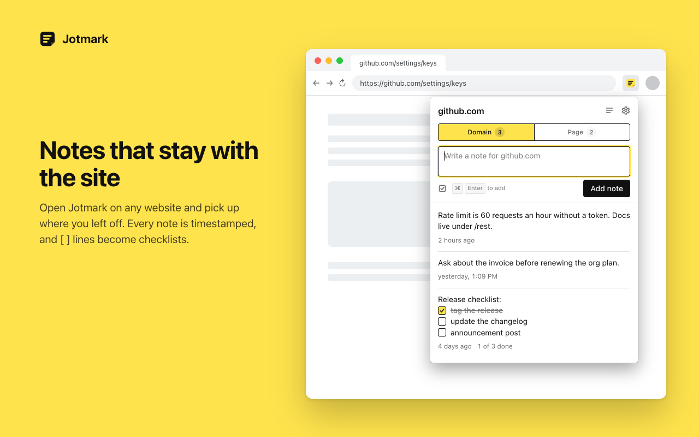

# Jotmark

Notes for every website. A Chrome extension that keeps timestamped notes attached to the site you are on, either for the whole domain or for the exact page. Everything stays in your browser.



## What it does

- Click the toolbar icon on any site and write a note. It is saved with a timestamp and is there again the next time you open Jotmark on that site.
- Switch between domain notes (everything on `github.com`) and page notes (only `github.com/settings/keys`). The counts on the switch show where you have already written something, and Jotmark can remember which scope you last used on each site.
- Edit, copy, and delete notes in place. Deleting offers an undo.
- Checklists: start a line with `[ ]` and it becomes a checkbox you can tick from the popup. Enter continues the list, `[x]` marks an item done, and notes with several items show how many are done. The state is plain text, so exports and other tools that use the same convention just work.
- The All notes page shows everything grouped by site, with search across notes and site names.
- Export and import your notes as JSON.
- A half written note is kept for the rest of the browser session if the popup closes before you add it.

## What it does not do

- It never injects scripts or styles into pages and never reads page content. The only thing it looks at is the URL of the tab you clicked it on.
- It has no server, no account, and no analytics. Notes live in `chrome.storage.local` on your machine.
- It does not run in the background. Nothing happens until you open the popup.

## Settings

| Group | Options |
| --- | --- |
| Appearance | System, light, or dark theme. Five marker colors. Four font sizes. System, serif, or monospace note font. Comfortable or compact density. |
| Notes | Add with Enter or Ctrl/Cmd Enter. Default scope. Remember the last scope per site. Newest or oldest first. Relative or absolute timestamps, 12 or 24 hour clock. Confirm before deleting. Turn web addresses into links. Checklists on or off. Show the page path in the header. |
| Page matching | Ignore the query string. Treat `#fragments` as separate pages. Group subdomains under the main domain. Common tracking parameters (`utm_*`, `fbclid`, and friends) are always ignored. |
| Data | Storage usage. Export JSON. Import with merge or replace. Reset settings. Delete all notes. |

The default keyboard shortcut to open the popup is `Alt+Shift+J`; change it at `chrome://extensions/shortcuts`.

## Permissions

| Permission | Why |
| --- | --- |
| `activeTab` | Read the URL of the current tab when you click the icon, so notes can be filed under the right domain or page. |
| `storage` | Save notes and settings locally. |

No host permissions, no content scripts, no background worker. See [PRIVACY.md](PRIVACY.md).

## Install

From the Chrome Web Store once the listing is live, or from source:

1. Clone this repository.
2. Open `chrome://extensions` and turn on Developer mode.
3. Click "Load unpacked" and pick the `extension` folder.

## Development

Plain HTML, CSS, and JavaScript modules. No bundler, no framework, no build step.

```
extension/           the unpacked extension
  manifest.json      Manifest V3
  popup/             toolbar popup
  options/           all notes, settings, about
  shared/            storage, settings, url handling, formatting, shared views, theme
  icons/             SVG source and rendered PNGs
tests/               unit tests (node:test) for the shared modules
scripts/             qa (end to end in headless Chrome), icons, screenshots, package
store/               Chrome Web Store listing text and images
```

```bash
pnpm install         # puppeteer-core only, used by the scripts
pnpm test            # unit tests
pnpm run qa          # end to end checks against the real extension
pnpm run icons       # render extension/icons/*.png from icon.svg
pnpm run screenshots # render store screenshots and promo tiles
pnpm run package     # build dist/jotmark-<version>.zip
```

The end to end script installs the unpacked extension into Chrome for Testing (from the puppeteer cache, or `CHROME_PATH`) and opens the popup as a tab with `chrome.tabs.query` stubbed to a chosen URL, so every popup state can be exercised without a real site.

See [CONTRIBUTING.md](CONTRIBUTING.md) for the ground rules and [CHANGELOG.md](CHANGELOG.md) for release notes.

## License

[MIT](LICENSE)
